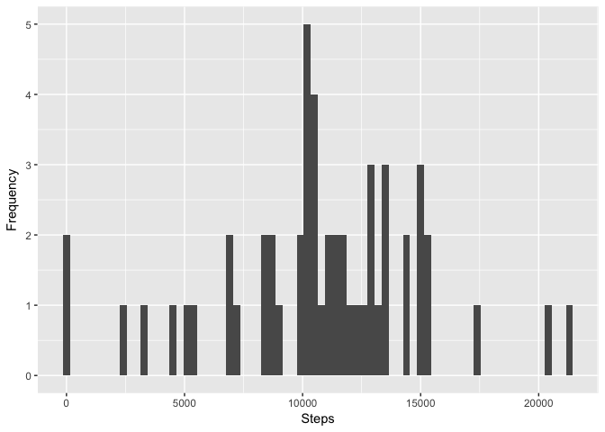
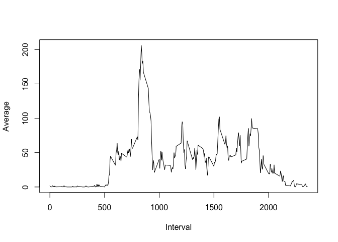
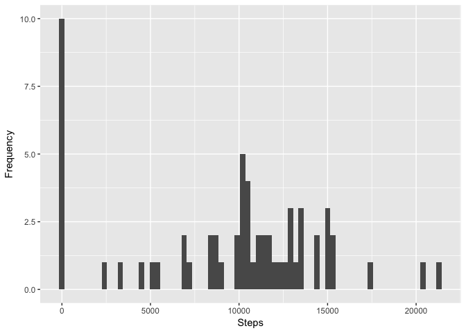
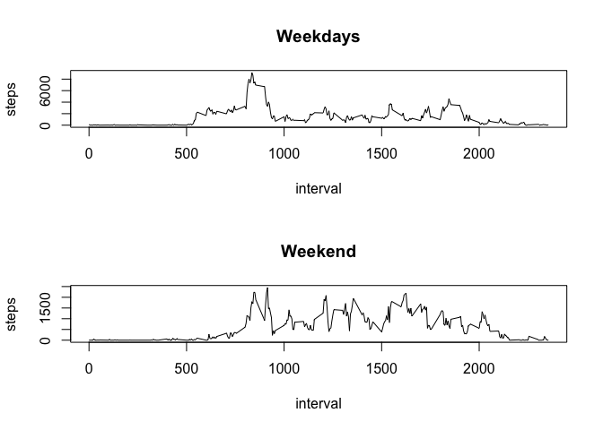

# Reproducible Research: Peer Assessment 1


## Loading and preprocessing the data


```r
data <- read.csv("activity.csv")
data$date <- as.POSIXct(data$date)
```


## What is mean total number of steps taken per day?

```r
stepsYears <- aggregate(steps ~ date, data, sum)
names(stepsYears) <- c("date","steps")
qplot(steps, data = stepsYears, geom="histogram", xlab = "Steps", ylab = "Frequency", binwidth = 300)
```

<!-- -->


```r
mean(stepsYears$steps)
```

```
## [1] 10766.19
```

```r
median(stepsYears$steps)
```

```
## [1] 10765
```


## What is the average daily activity pattern?


```r
stepsInterval <- aggregate(steps ~ interval, data, mean)
names(stepsInterval) <- c("interval","steps")
plot(stepsInterval$interval, stepsInterval$steps, type="l", xlab = "Interval", ylab = "Average")
```

<!-- -->


```r
stepsInterval[which.max(stepsInterval$steps),]$interval
```

```
## [1] 835
```


## Imputing missing values

```r
sum(!complete.cases(data))
```

```
## [1] 2304
```

```r
completedData <- data
completedData[is.na(completedData$steps), "steps"] <- 0
```


```r
stepsYears <- aggregate(steps ~ date, completedData, sum)
names(stepsYears) <- c("date","steps")
qplot(steps, data = stepsYears, geom="histogram", xlab = "Steps", ylab = "Frequency", binwidth = 300)
```

<!-- -->

```r
mean(stepsYears$steps)
```

```
## [1] 9354.23
```

```r
median(stepsYears$steps)
```

```
## [1] 10395
```

In the first part of the assigment, we have that the mean is equal to $10766.19$ and the median is $10765$. After imputing missing values with $0$ we have now that the mean and the median are $9354$ and $10395$, respectively. The median changes just a little, but the mean has a significant variation.
## Are there differences in activity patterns between weekdays and weekends?


```r
completedData$week <- ifelse(weekdays(data$date) == "Saturday" | weekdays(data$date) == "Sunday" ,"weekend","weekday")
```


```r
weekdays <- completedData[completedData$week == "weekday",]
weekend <- completedData[completedData$week == "weekend",]
weekdays <- aggregate(steps ~ interval, weekdays, sum)
weekend <- aggregate(steps ~ interval, weekend, sum)

par(mfrow = c(2, 1))

plot(weekdays, type = "l", main = "Weekdays")
plot(weekend, type = "l", main = "Weekend")
```

<!-- -->

There is a small difference in the activity during the days of the week and the days of the weekend, as it is possible to visualize in the plots. As expected from my daily experience, during weekends people tend to start moving later. 
